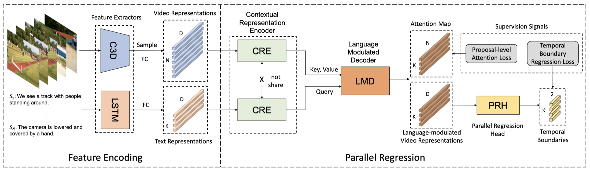

###  End-to-end dense video grounding via parallel regression (CVIU 2024)

[Fengyuan Shi](https://shifengyuan1999.github.io/), 
[Weilin Huang](https://www.whuang.org/),
[Limin Wang](https://wanglimin.github.io/)
<br/>

[](https://arxiv.org/abs/2109.11265)

<p align="center">

</p>


## Requirements

```shell
conda create -n prvg python=3.10
conda activate prvg
bash install.txt
```

## Dataset
### Visual Features on ActivityNet Captions
Please download the C3D features from the official website of ActivityNet: [Official C3D Feature](http://activity-net.org/download.html).
### Visual Features on TACoS
Please download the C3D features for [training set](https://drive.google.com/file/d/1zQp0aYGFCm8PqqHOh4UtXfy2U3pJMBeu/view?usp=sharing)  and [test set](https://drive.google.com/file/d/1zC-UrspRf42Qiu5prQw4fQrbgLQfJN-P/view?usp=sharing) of TACoS dataset.


## Inference
[Checkpoints](https://drive.google.com/drive/folders/1ZKFfqkvF_pQp-3sKqE1CxzRhB6E42ZM7?usp=drive_link)
```shell
# ActivityNet Captions
export CUDA_VISIBLE_DEVICES=0 
python eval.py --verbose --cfg ../experiments/activitynet/acnet_test.yaml

# TACoS
export CUDA_VISIBLE_DEVICES=1 
python eval.py --verbose --cfg ../experiments/tacos/tacos_test.yaml
```

## Training
```shell
# ActivityNet Captions
export CUDA_VISIBLE_DEVICES=0 
python main.py --verbose --cfg ../experiments/activitynet/acnet.yaml

# TACoS
export CUDA_VISIBLE_DEVICES=1 
python main.py --verbose --cfg ../experiments/tacos/tacos.yaml
```

## Citation
If you make use of our work, please cite our paper.
```bibtex
@article{shi2024end,
  title={End-to-end dense video grounding via parallel regression},
  author={Shi, Fengyuan and Huang, Weilin and Wang, Limin},
  journal={Computer Vision and Image Understanding},
  volume={242},
  pages={103980},
  year={2024},
  publisher={Elsevier}
}
```

## Acknowledgments
This project is built upon [DepNet](https://github.com/baopj/DenseEventsGrounding). Thanks for their contributions!